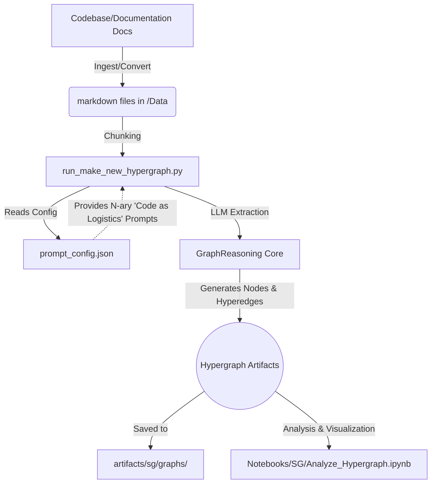

# HyperGraphReasoning for Code-as-Logistics Analysis

This repository adapts the methodology introduced in:

**"Higher-Order Knowledge Representations for Agentic Scientific Reasoning"**  
Isabella Stewart, Markus J. Buehler (MIT, 2026)

We have uniquely repurposed that higher-order knowledge representation framework to **analyze source code and architecture**. By treating software execution as a **logistical process**, this pipeline generates hypergraphs that map code flow, variables, and API calls as "shipments," "facilities," and "dispatch routes." The end result is a high-level documentation artifact that reads like a logistical workflow, making complex codebases easier to understand and reason about.

---

## Workflow Diagram



---

## What this project does

This pipeline converts source code, technical specifications, and system architecture documents into:

- **Logistics-mapped Hypergraphs:** Higher-order multi-entity events that represent code execution.
- **Abstracted Architectures:** Data flow becomes "inventory movement," functions become "processing facilities," and databases become "warehouses."
- **Graph/hypergraph artifacts:** For root-cause analysis, system documentation, and agent workflows.

Typical extracted entities mapped from code include:
- Variables/Data Objects -> Shipments, SKU, Container
- Functions/Methods -> Facility, Processing Center, Warehouse
- API Calls/Network I/O -> Dispatch Route, Lane, Vehicle
- Exceptions/Errors -> KPI Violations, Exceptions, Delays

---

## Acknowledgement of repurposing

This codebase is based on and inspired by the original hypergraph reasoning framework from the paper above.  
Our use case shifts the domain from scientific materials reasoning to mapping software architecture as a logistical intelligence operation.

Core algorithmic ideas retained:

- chunked document/code processing
- LLM-based architecture/relation extraction using n-ary representations (Hyperedges)
- graph + hypergraph analysis workflows

Main adaptations in this repository:

- code-as-a-logistics format in extraction prompts
- JSON-structured output handling
- software-architecture-oriented graph semantics mapped to logistics phrasing

---

## Repository layout

- `GraphReasoning/` — main source package
- `scripts/` — runnable pipeline and utility scripts
- `Notebooks/SG/` — notebooks for generation, analysis, and agents
  - `Data/` — source markdown inputs for notebook workflows
  - `lib/` — local JavaScript/CSS assets for notebook graph visualization
- `run_make_new_hypergraph.py` — compatibility entrypoint (delegates to `scripts/`)
- `pdf2markdown.py` — compatibility entrypoint (delegates to `scripts/`)
- `artifacts/`
  - `sg/graphs/` — per-document graph artifacts
  - `sg/integrated/` — merged/integrated graph artifacts
  - `cache/chunks/` — chunk-level cache

Notebook-local legacy output folders such as `GRAPHDATA_paper/` and `GRAPHDATA_OUTPUT_paper/` were removed in favor of the canonical `artifacts/sg/` layout.

---

## Quickstart (logistics workflow)

### 1) Create environment

```bash
python -m venv .venv
# Windows PowerShell
.\.venv\Scripts\Activate.ps1
python -m pip install --upgrade pip
pip install -r requirements.txt
pip install -e .
```

### 2) Configure model access

Set required environment variables in your shell or `.env`:

- `OPENAI_API_KEY` (or your provider key)
- `MODEL_NAME`
- `URL` (if applicable to your provider/client wrapper)

### 2.1) Edit prompts in one place

Prompt templates are centralized in `prompt_config.json` at repository root.

- Edit this file to change extraction, distillation, and figure prompts.
- Optional runtime override: set `GRAPH_REASONING_PROMPT_CONFIG` to another JSON file.
- Script override: `python run_make_new_hypergraph.py --prompt-config path/to/prompts.json`

### 3) Put logistics markdown files here

`Data/`

### 4) Run pipeline

```bash
python run_make_new_hypergraph.py
```

### 5) Outputs

- per-doc outputs in `artifacts/sg/graphs/`
- integrated outputs in `artifacts/sg/integrated/`

---

## Structured output contract (JSON)

The extraction now supports plain JSON outputs directly.

### Directed graph extraction expects:

```json
{
  "nodes": [{"id": "...", "type": "..."}],
  "edges": [{"source": "...", "target": "...", "relation": "..."}]
}
```

### Hypergraph extraction expects:

```json
{
  "events": [
    {
      "source": ["..."],
      "relation": "...",
      "target": ["..."]
    }
  ]
}
```

Each event maps to one hyperedge over `source ∪ target`.

---

## Optional PDF export dependency

If you use `save_PDF=True`, install:

```bash
pip install pdfkit
```

and ensure `wkhtmltopdf` is installed and on PATH.

---

## Suggested domain onboarding checklist

Before production usage for logistics:

1. Curate a validation corpus (orders, shipment updates, SOPs, incident reports)
2. Define canonical relation vocabulary (e.g., `departs_from`, `arrives_at`, `delayed_by`)
3. Evaluate extraction precision/recall on a hand-labeled set
4. Add relation normalization and schema validation retries
5. Freeze prompt versioning + cache versioning for reproducibility

---

## Citation (original method)

If this work contributes to your research or systems documentation, cite the original paper:

```bibtex
@article{stewartbuehler2025hypergraphreasoning,
  title     = {Higher-Order Knowledge Representations for Agentic Scientific Reasoning},
  author    = {I.A. Stewart and M.J. Buehler},
  journal   = {arXiv},
  year      = {2026},
  doi       = {https://arxiv.org/abs/2601.04878}
}
```
